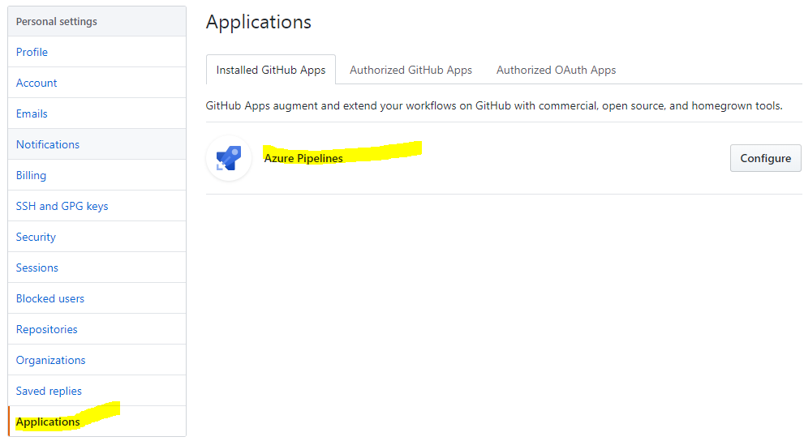
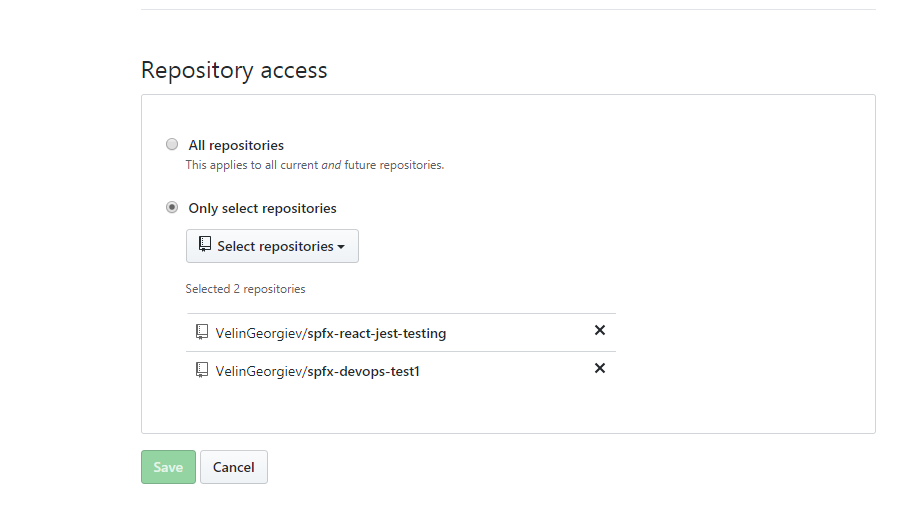
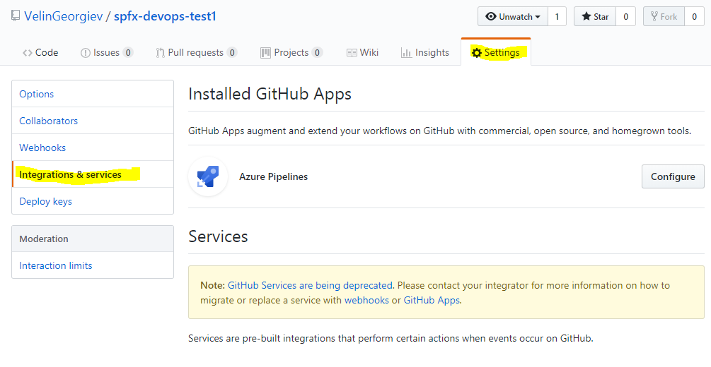

# Azure DevOps Pipelines example guide #

## Summary

This "devops" folder contains scripts that can be used to create fully automated devops pipeline that can pickup the SPFx code from the source control, build it and deploy it to SharePoint Online without any user intervention.

## The example uses Github, but the same pipeline can be used with Azure DevOps git repos.

The example has build and release scripts that can be used with Github as well as with Azure DevOps git repos. I will use the Github since it is free and can be tested by everyone.

## Build definition

The build folder has two build definitions. The PRE-BUILD definition ("azure-pipelines-pre-build.yml") is to be run before the code goes to the master branch to verify that the code will not break the existing branch. The BUILD definition ("azure-pipelines-build.yaml") is to be run after the new code is merged into the master branch.

## Release definitions

The release pipeline includes office-365-CLI-add-app.sh script and will be using Nodejs and Office 365 CLI to deploy the built artifacts to SharePoint app catalog.

## How to enable Azure DevOps Pipelines with Github

There is a good article on how to do that here:  https://blog.github.com/2018-09-10-azure-pipelines-now-available-in-github-marketplace/

## Minimal path of awsome

1. Install the Azure Pipelines to your Github account https://github.com/marketplace/azure-pipelines
2. Create new repository or attach the pipelines to existing repository here: https://github.com/settings/installations

3. Click the configure button and set it up to run with all repositories or specific one

4. Go to the repo you configured to work with Azure Pipelines

